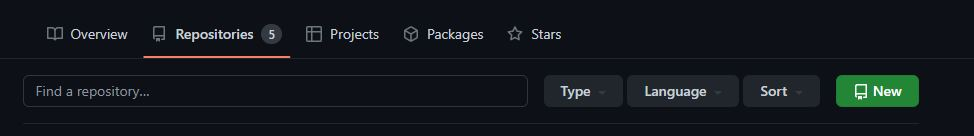
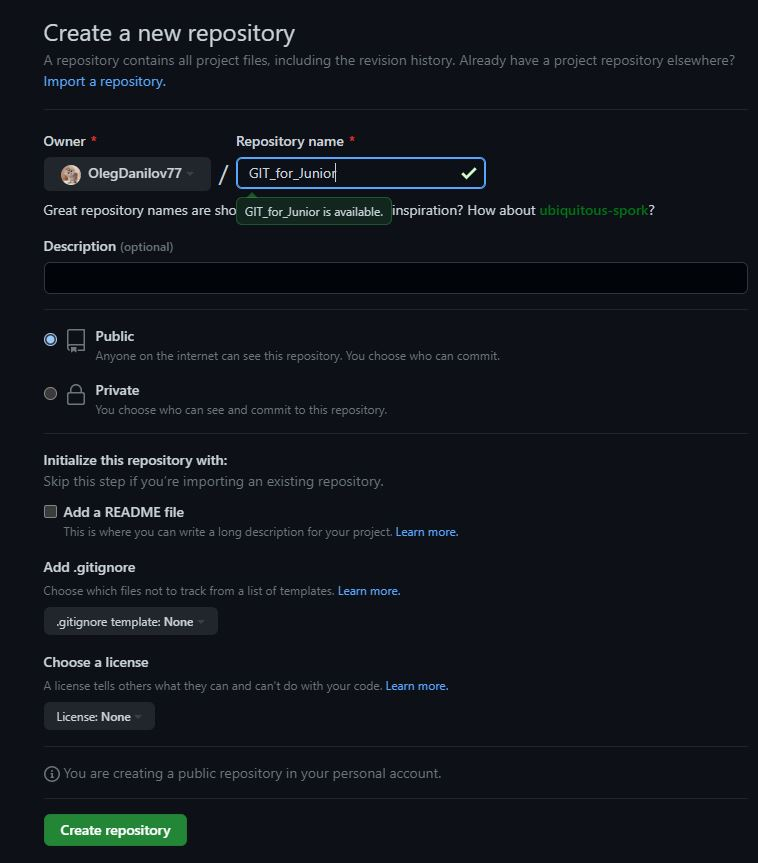
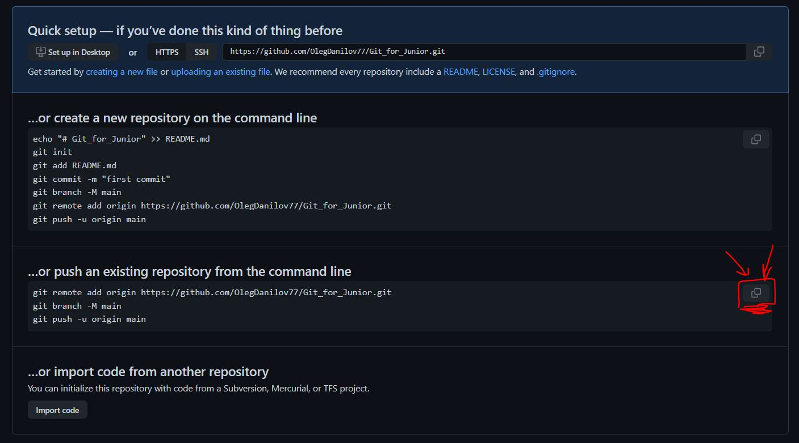
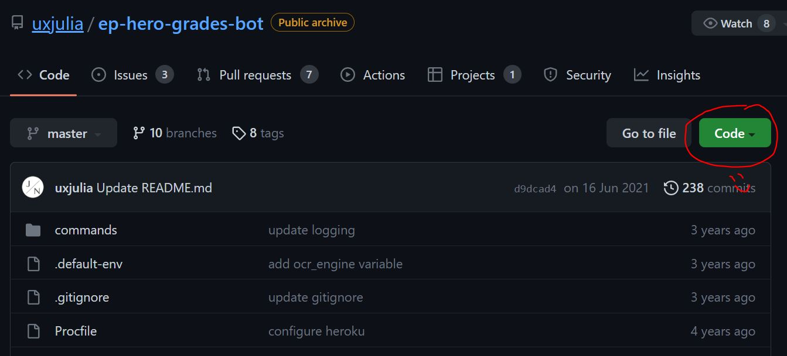
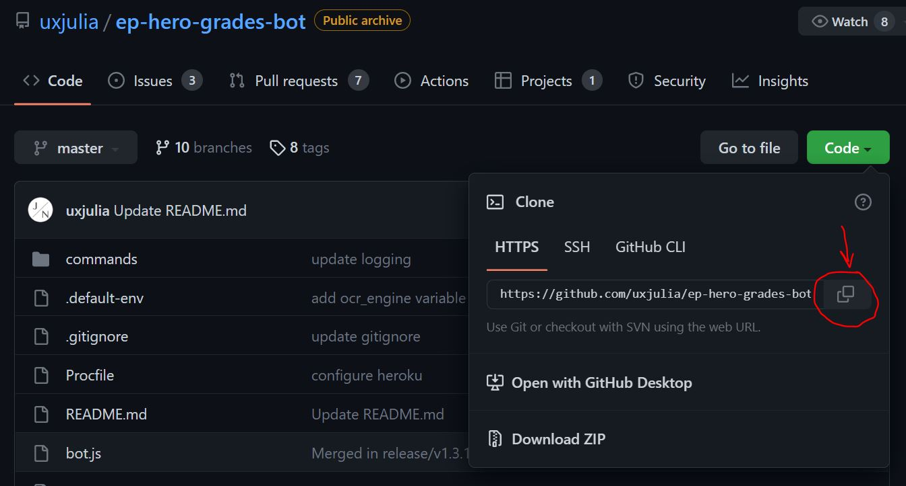
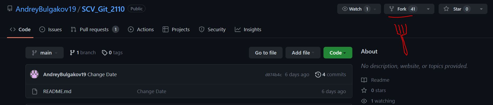
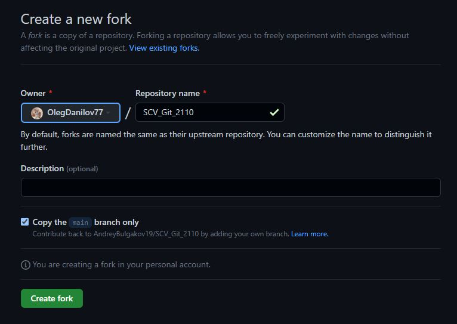
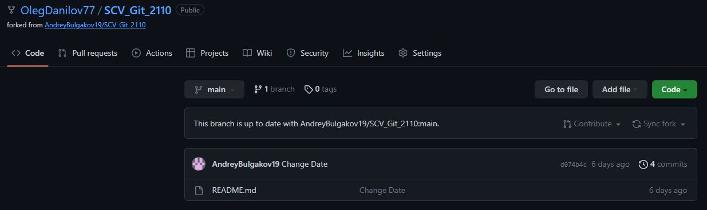
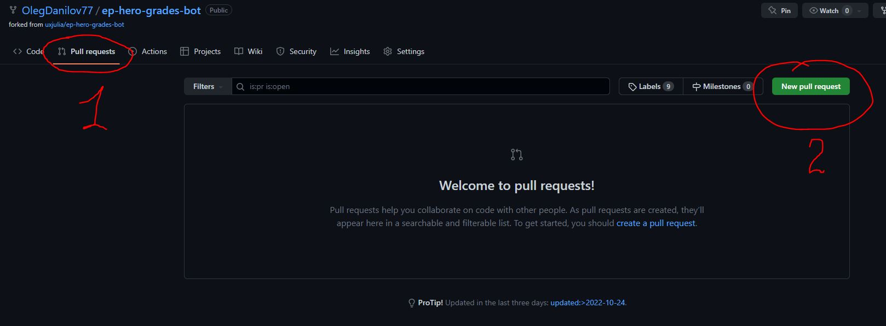
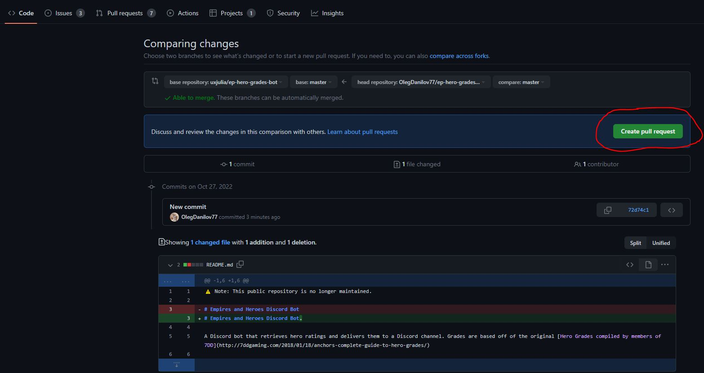

# Работа с GIT для разработчиков младшего возраста

## 1. Проверка наличия установленного GIT
В терминале выполнить команду `git version`.

Если GIT установлен, появтся сообщение с информацией версии программы. Иначе будет сообщение об ошибке.
***
## 2. Установка GIT
Загружаем последнюю версию GIT с сайта https://git-scm.com/downloads

Устанавливаем с настройками по умолчанию.
***
## 3. Настройка GIT
При первом использовании GIT необходимо представиться. Для этого необходимо ввести в терминале две команды:

```
git config --global username Имя пользователя
git config --global user.email Почта пользователя
```
***
## 4. Инициализация репозитория

Репозиторий можно инициализировать двумя способами:

1. Ввести команду 
```
git init
```
2. Клонировать репозиторий из любого места
```
git clone
```
И, поздравляем Вас! Ваш первый репозиторий создан!


***
## 5. Проверка состояния репозитория
Чтобы узнать как обстоят дела в нашем репозитории, необходимо ввести команду:
```
git status
```
Здесь мы увидим, где и в каких файлах произошли изменения
***
## 6. Добавляем сведения об измененном файле

Каждый файл в рабочей папке (репозитории) может находиться в двух состояниях:
* под версионным контролем (отслеживаемые)
* без версионного контроля (неостлеживаемые)

Когда из большого количества файлов в папке проекта нужно изменить всего один, то вводим:
```
git add Имя файла с расширением
```
> Здесь имеется лайфхак!
> Чтобы не переписывать полностью имя файла, введи первые пару букв, а затем нажми TAB и увидишь настоящую **магию )))**
***
## 7. Коммиты, кто они?


Коммиты - это инопланетные сущности, живущие в самом сердце репозитория!
Без них ничего бы не было, и GIT не работал бы так, как надо!

Ну а если серьезно, то это такие `точки сохранения`. Как в компьютерных играх, помните? ;)
> **COMMIT** с английского языка переводится как **Фиксировать**.

- То есть эта команда надежно и прочно фиксирует все ваши изменения, произошедшие с последнего коммита, и присваивает ему уникальный номер!

- Но чтобы не запутаться, что же именно вы там наизменяли, очень желательно подписать свой коммит. И вот как это выглядит:
```
git commit -m "Ваш комментарий к сохранению"
```
Так, периодически сохраняя результаты Вашей работы, вы сможете используя ***Магию GIT***, как на машине времени возвращаться в свои сохранения!


Как же это сделать?
Сейчас разберемся!
***
## 8. Просмотр всех коммитов

Чтобы увидеть все изменения, произошедшие в проекте и иметь возможность переключаться между ними, необходимо для начала их увидеть, для этого введите в терминале команду:

```
git log
```

> Если вы вдруг застряли в тексте терминала, нажмите клавишу `q`

Вы увидите большой список коммитов, где каждому будет присовен ОГРОМНЫЙ ЖЕЛТЫЙ многозначный номер, это, так называемый ХЭШ-номер!


Возможно Вам не очень удобно читать и просматривать все эти коммиты, попробуйте немного другую команду:

```
git log --oneline
```

И, вуаля, все коммиты в строчку, как на параде, выстроились и готовы помочь Вам в разработке!


Как видим желтый номер стал покороче!
На самом деле это первые 7 цифр номера, которых зачастую вполне достаточно для работы!
***

## 9. Переключаемся между коммитами

Ну что, друзья, теперь немного о магии!
Как же вернуться во времени назад?
Как вернуться в свое будущее?
Да проще простого!

```
git checkout НОМЕР КОММИТА
```
Как видите, вы перенеслись в предыдущее состояние проекта! Мои поздравления, Макфлай!

Пока не будем ничего здесь менять (мы же только начинаем разбираться в GIT), поэтому сразу домой.

Для этого нам необходимо перейти в ТЕКУЩИЙ номер нашего коммита. Какой же у него номер?

Не переживайте, уважаемые путешественники во времени! Просто вместо номера напишите `master`
```
git checkout master
```
**И картиночку - чтобы не забыли!**


***
## 10. Как узнать различия между коммитами

Для того чтобы наглядно увидеть, какие изменения произошли между коммитами, у GIT имеется специальная команда:
```
git diff
```
Выполнив её, GIT покажет какие изменения произошли в коммите. Наглядно и красиво!
***

## 11. Игнорирование файлов в GIT

Если вдруг в Вашей рабочей папке находятся файлы, которые вы по разным причинам не хотите отслеживать средствами GIT `(напрмер картинки, которые гордые программисты решили не отображать в своих гениальных проектах)`, достаточно создать в рабочей папке новый файл с названием
```
.gitignore
```
именно так! начиная с точки! (.), а затем в нем начать писать названия файлов, папок и даже целых групп файлов по признакам расширения, **все они будут игнорироваться GIT при его работе**.
```
1. test.jpg
2. superprogramma.md
3. *.bmp
4. *.doc
```
***
## 12. Ветки


Да, друзья, вы не ослышались!
Наш всемогущий GIT способен работать с ветками! Но не в плане сельского хозяйства или плетения корзинок (как вы вообще могли такое подумать!)

На самом деле эти ветки можно представить как ... ветки... дерева. Ну то есть очень уж точное название.

Они позволяют создать копию текущего состояния файла и дальнейшие изменеиня производить в этой копии, не боясь нарушить оригинал.

При этом несколько человек могут работать над разными участками программы одновременно, что конечно же очень удобно!

### 1. Создание веток


Ветки создаются командой 
```
git branch имя_ветки_на_англ_без_пробелов
```
И создать их можно сколько угодно!


### 2. Просмотр имеющихся веток

Для того, чтобы узнать какие есть ветки и в какой вы сейчас находитесь введите
```
git branch
```
Наш друг звездочка (*) покажет нам, в какой ветке мы находимся!

### 3. Переход в имеющиеся ветки

После того как создали ветку, в нее еще необходимо перейти!
```
git checkot то_самое_имя_ветки_на_англ_без_пробелов
```
И вы на ветке, как те птички!


>И как всегда, для вас, мои маленькие любители программирования, лайфхак. Две команды 
```
git branch имя_ветки_на_англ_без_пробелов
```
>и
```
git checkot то_самое_имя_ветки_на_англ_без_пробелов
```
>>можно замениить **одной** командой!
```
git checkout -b то_самое_которое_мы_хотели_использовать_имя_ветки_на_англ_без_пробелов
```

### 4. Присоединение веток

Поработав в ветках, мы можем захотеть присоединить результат труда к основной ветке.

Для этого, _**ВНИМАНИЕ!!!**_

Переходим в ту ветку, **В КОТОРУЮ** мы хотим добавить изменения, не перепутайте!

И вводим команду:
```
git merge название_ветки_ИЗ_КОТОРОЙ_мы добавляем
```
Запомнить просто, вспоминаем про наши ветки, в которых команда `merge` что-то вроде прививания новой ветки к дереву.


Так вот, чтобы черенок прижился, надо `К БОЛЬШОЙ ВЕТКЕ` (у нас она называется `master`) привить мааааленькую (у нас она называется, что то вроде, `vetka_so_strannym_nazvaniem`).

То есть находиться надо на БОЛЬШОЙ ветке, куда мы всегда можем перейти уже известной нам командой `git checkout master`.

### 5. Разрешение конфликтов

Иногда (на самом деле, довольно часто), при слиянии ветки может так получиться что в одном месте  (напрмер в строчке 232) ветки `master` написано одно (напрмер слово `МАША`), а в ветке `vetka_so_strannym_nazvaniem` НА ЭТОЙ ЖЕ СТРОЧКЕ другое (например слово `ДАША`).

И возникает КОНФЛИКТ!!!

Потому что наш умненький GIT не понимает, кого выбрать? 
>Брюнетку МАШУ?

>Или блондинку ДАШУ?


И вот здесь GIT обращается к тебе, мой юный кодер, с просьбой, что же делать?
* Принять Машу без Даши
* Принять Дашу без Маши
* Принять обеих девчонок, они такие классные!
* Сравнить их качества и выбрать лучшие из них!

И от твоего выбора зависит, какая часть текста будет добавлена в принимающую ветку:
* только текст из `master`
* только текст из `vetka_so_strannym_nazvaniem`
* текст из `master`, а за ним текст из`vetka_so_strannym_nazvaniem`
* Запустить новое окно, в котором можно будет увидеть и сравнить все изменения (это уже для профи...)

После разрешения конфликта не забудьте зафиксировать, или на языке программистов - закоммитить результаты работы командой COMMIT, как мы разбирали ранее!

Будьте внимательны, порой проще принять все что есть, а потом аккуратно убрать лишнее.

### 6. Удаление веток

Когда вы слили все что нужно, ветки для удобства можно удалить простой командой:

```
git branch -d удаляемая_ветка
```

Вот так! и никаких корзинок!


***
# Работа с удаленными репозиториями

Друзья! Все чем мы занимались раньше - относилось исключительно к Вашему компьютеру с Вашим репозиторием (папочкой, где хранились все Ваши файлы)

## Пора выходить на новый уровень!

Для того, чтобы программисты могли разрабатывать и хранить свои репозитории в Интернете, было создано несколько специальных сайтов, самым популярным среди них считается GitHub.

https://github.com/

Поэтому, смело регистрируемся на нем и начинаем работу!

***
## 1. Создание удаленного репозитория


 На своей страничке в GitHub находим вкладку `Repository` и нажимаем на зеленую кнопку `New`.



В открывшемся окне после вашего никнейма вводим красивое название репозитория и внизу жмем зеленую кнопку 



затем, нажимаем кнопку скопировать напротив трех строк для нашего друга Git, чтобы он понял, где в Интернете расположен наш репозиторий



Теперь переходим в VSCode и в строке терминала вставляем все что скопировали и...

В первый раз VSCode спросит у вас логин и пароль от вашей учетной записи в GitHub, чтобы, как говорится, враг не пробрался, и лишь потом - УРА! 
Наш местный, родненький, репозиторий заимел себе близнеца в Интернете!
***
## 2. Клонирование чужого репозитория


Вам совершенно никто не мешает взять и скопировать чей-то репозитторий себе для работы! 
Для начала создаем новую рабочую папку.
Для этого находим на GitHub то, что нам интересно, например в поиске, нажимаем на нужный репозиторий и выбираем зеленую кнопку `Code`:



В открывшемся окне выбираем "копировать ссылку":



Затем заходим в VSCode и набираем новую команду: 
```
git clone ВСТАВЛЯЕМ ССЫЛКУ ИЗ ГИТХАБА
```
И копия интернет-репозиттория загружена в Ваш компьютер.

Теперь для корректной работы необходимо перейти в папку нового репозитория, для чего набери команду `cd`, что сокращенно от `Change Directory`, то есть - Давайте сменим папку для работы:
```
cd ИМЯ СКАЧАННОЙ ПАПКИ
```
И, можно начинать работу!

***
## 3. Работа с удаленными репозиториями

Итак, репозиторий, свой, или честно скопированный, привязан к своему интеренет-другу, пора начинать работу!

После того, как написали большую кучу кода, сохранили и сделали коммит, вам захотелось, чтобы результат вашей работы попал на GiTHub, для этого вводим команду `push`, что переводится как `толкать`:
```
git push
```
и наш любимый Git отправит все, что вы натворили, в Вашу страничку на GitHub

Так же и наоборот, вы или кто-то еще изменил данные на GitHub, для того чтобы их получить, используем команду `pull`, что означает `тянуть`:
```
git pull
```
> **Важно!** Команда pull при скачивании автоматически производит merge с имеющейся локальной версией проекта.

## 4. Помогаем в разработке 

Вот мы и пришли к логическому завершению, давайте поможем какому-то разработчику с проектом!

Для этого, также ищем проект, который Вы хотели бы дополнить, и нажимаем на кнопочку `Fork`, что переводится как `Вилка`, видимо программисты имели ввиду про ответвление от основной ветви разработки...



затем зеленая кнопочка



и, оп-па! у нас в аккаунте появился новый, слегка "форкнутый" репозиторий!



Теперь можно смело клонировать данный репозиторий `git clone ИНТРНЕТ АДРЕС`, к себе в компьютер и начать работать в нем, правда программисты решили, что правильнее всего это делать в отдельной ветке `git branch NewBranch`.

По завершении работы отправляем изменения на GitHub, где нам необходимо предложить свои изменения хозяину проекта, так называемый `pull request`. Для этого заходим к себе на страничку, в раздел форкнутого репозитория и выбираем соответсвующий раздел:



нажимаем на зеленую кнопку, затем:



И все, предложения направлены, ПОЗДРАВЛЯЮ!!!


## И В ЗАВЕРШЕНИИ...

Друзья!

Вы только открываете для себя такой мощный и нужный в современном программировании инструмент как GIT.

У нас нет сомнений, что изучая его, вы приблизите себя к освоению такой интересной и уважемой профессии как ПРОГРАММИСТ РАЗРАБОТЧИК.

Но во всем необходимо совершенствоваться, поэтому, чтобы получше узнать GIT переходите по ссылке документации к нему https://git-scm.com/docs и узнавайте много нового!

> До новых встреч!
>>С уважением, команда-разработчик, 
NanobyteStyle☺. Если руководству GeekBrains понравился стиль и слог изложения, могу сделать более наполненную картинками и более точную в описании инструкцию для школьников или начинающих студентов.

***


